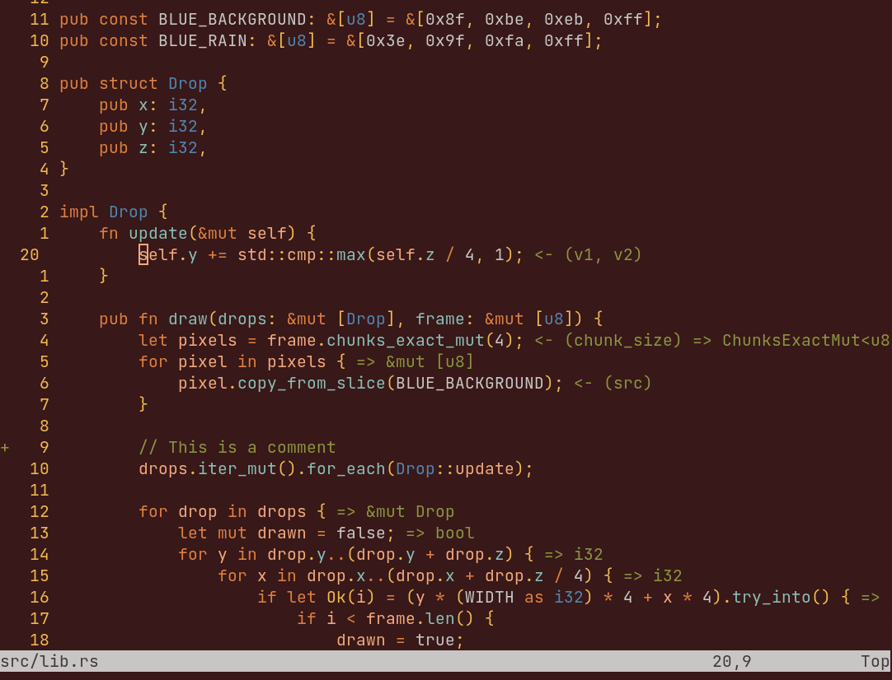
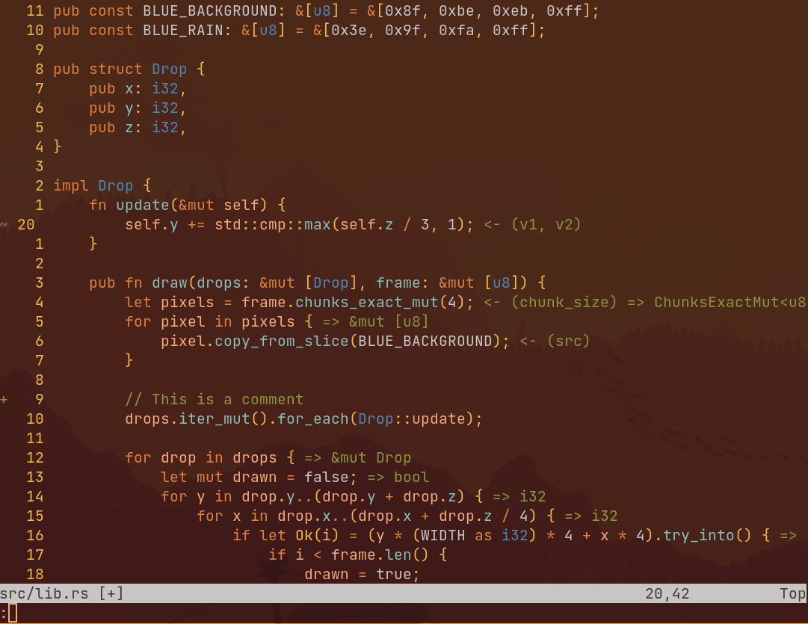
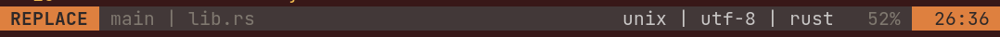
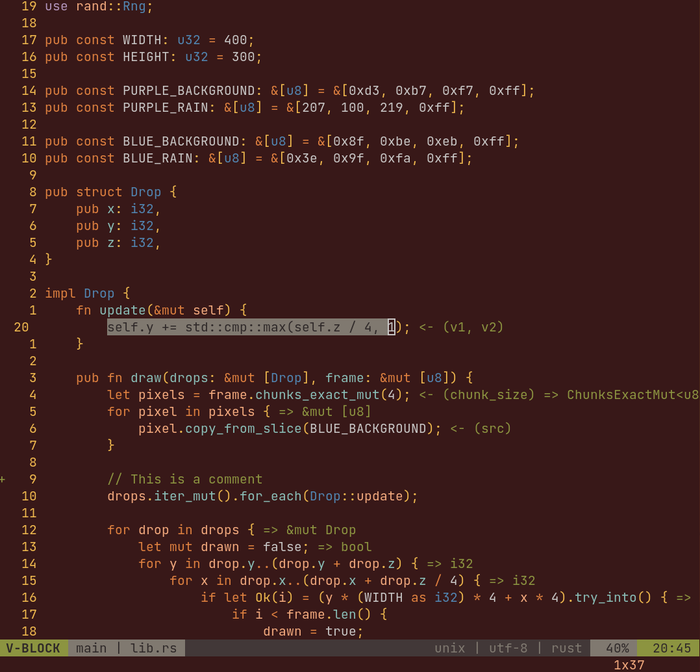

# Firewatch - Vim Color Scheme


This is a colorscheme I created to mesh well with the colors in the game Firewatch.

## Installation
If you use [`vim-plug`](https://github.com/junegunn/vim-plug), add this to your plugins:
```vim
Plug 'zoomiti/firewatch'
```
Then set your colorscheme with:
```vim
colorscheme fire
```

## Transparent Background
By default this colorscheme has an opaque background that meshes well with the
overall colorscheme. If you want to disable it to allow your terminal to have a
transparent buffer add this anywhere to your `.vimrc`.

```vim
let g:dark_transp_bg = 1
```

Or if you use Neovim and an `init.lua`:
```lua 
vim.g.dark_transp_bg = 1

-- or this

vim.cmd [[
let g:dark_transp_bg = 1
]]
```


## lualine Support
This colorscheme comes built in with lualine support




Normal mode and Command mode share the same colorscheme.

## Screenshots



